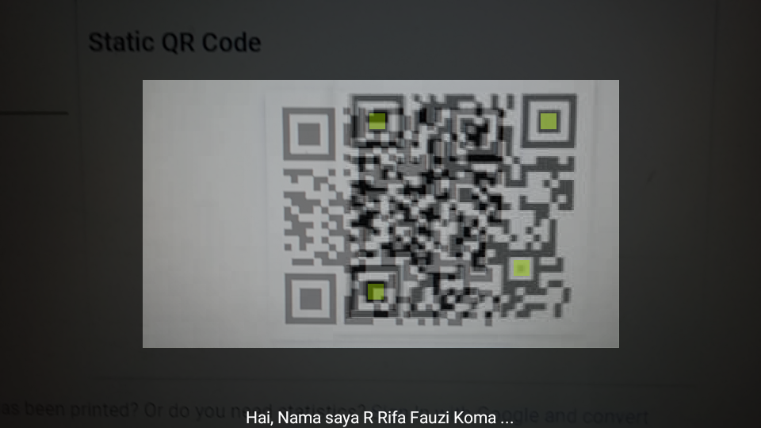
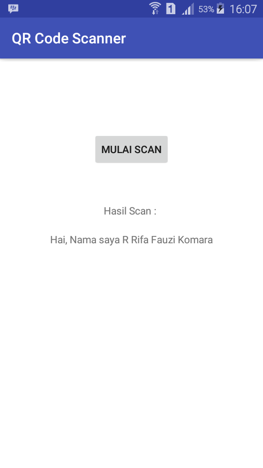

# QRCodeScanner
Simple project android studio for scan QR Code using library Zxing

### Screenshots
<pre>
     


</pre>

### Instructions for running the application source code
Import library into file ***build.gradle*** module: app 

```
dependencies {
    .....
    implementation 'info.vividcode.android.zxing:capture-activity:2.3.0-1.+'
}
```

Add permission into file ***AndroidManifest.xml***

```
<uses-permission android:name="android.permission.CAMERA"/>
<uses-permission android:name="android.permission.WAKE_LOCK" />
<uses-permission android:name="android.permission.READ_PHONE_STATE"/>
```

Last, add activity ***CaptureActivity*** into file ***AndroidManifest.xml***

```
<application
       ......
        android:theme="@style/AppTheme">
        ......
        <activity
            android:name="info.vividcode.android.zxing.CaptureActivity"
            android:configChanges="orientation|keyboardHidden"
            android:screenOrientation="landscape"
            android:theme="@android:style/Theme.NoTitleBar.Fullscreen"
            android:windowSoftInputMode="stateAlwaysHidden">
            <intent-filter>
                <action android:name="android.intent.action.MAIN" />

                <category android:name="android.intent.category.DEFAULT" />
            </intent-filter>
            <intent-filter>
                <action android:name="com.google.zxing.client.android.SCAN" />

                <category android:name="android.intent.category.DEFAULT" />
            </intent-filter>
        </activity>
            
    </application>
```

### Notes
Don't forget to allow permission in your phone, **Settings -> Apps -> (Name of this app) -> Allow**

## Author

* **R Rifa Fauzi Komara**

Don't forget to follow and give me ★
